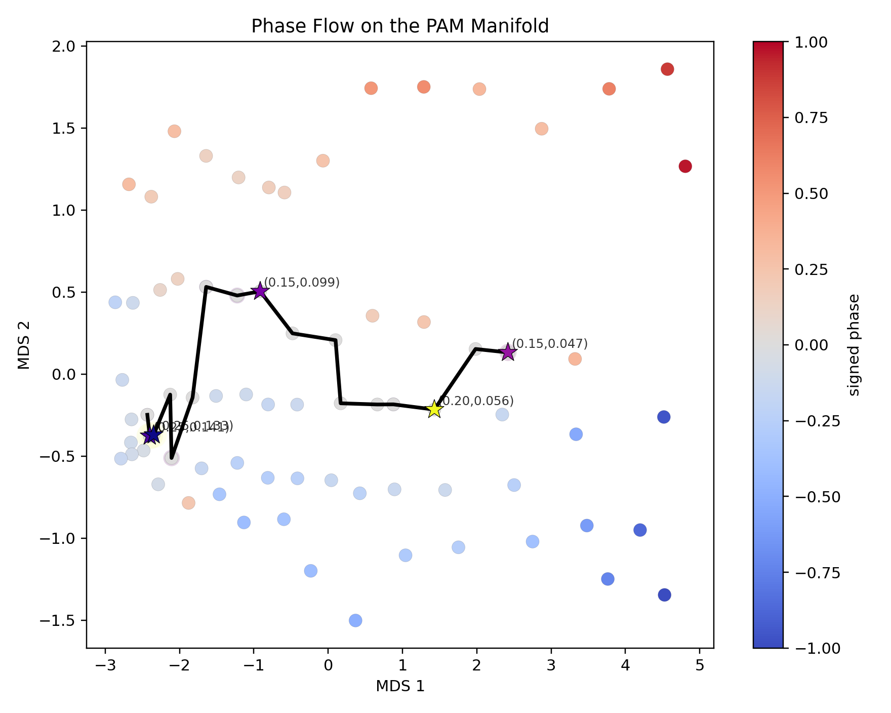

# PAM Observatory

**Phase Analysis of Meaning (PAM)**

The PAM Observatory is an experimental instrument for studying how meaning behaves across a parameter manifold.

It combines large-scale parameter sweeps with information geometry, field dynamics, and topology extraction to reveal how systems organize, transition, and stabilize.


---

## Preprint

Preprint on Zenodo: [Geometric Constraints on Transition Dynamics in Recursive Language Systems](https://zenodo.org/records/19218700)  
DOI: [10.5281/zenodo.19218700](https://doi.org/10.5281/zenodo.19218700)

---

## Status

Active research repository.

---

## Phase Flow on the PAM Manifold



Each point represents a parameter configuration \((r, \alpha)\), embedded using Fisher–information geodesic distances.  
Color encodes a **signed phase coordinate**, revealing two distinct regimes separated by an emergent phase boundary (black curve).  
Critical points (stars) concentrate along this boundary, indicating regions of maximal structural change.

This provides a **purely data-driven phase diagram**, derived from the intrinsic geometry of the system.

---

## Overview

We study the parameter space:
```math
\theta = (r, \alpha)
```
by running controlled experiments and extracting structure at multiple levels:

- observables → what is measured  
- geometry → how states are arranged  
- dynamics → how states evolve  
- topology → how behavior is organized  

The system has evolved from a visualization pipeline into a **geometry + dynamics + topology instrument**.

---

## Core Idea

> The goal is not to identify what a system *is*,  
> but how it *behaves under transformation*.

This leads to a central principle:

> **Topology is the relational identity of the field.**

Two runs are considered equivalent if they share:
- critical point structure  
- connectivity  
- seam relationships  

—not if they merely look similar.

---

## Pipeline

The observatory processes data through the following stages:

```text
experiments (exp_batch.py)
↓
observables (index.csv)
↓
Fisher Information Metric (fim.py)
↓
Fisher distance graph (fim_distance.py)
↓
MDS embedding (fim_mds.py)
↓
curvature estimation (fim_curvature.py)
↓
phase field (fim_signed_phase.py)
↓
continuous scalar field φ(x, y)
↓
flow field v = -∇φ
↓
field topology (critical points, basins, saddles)
↓
operators (GE / S) → experimental probing
```
---

## Conceptual Layers

### Geometry
- Fisher Information Metric  
- distance structure  
- manifold embedding  
- curvature  

### Dynamics
- signed phase field  
- flow field \( v = -\nabla \phi \)  
- trajectory behavior  

### Topology
- sinks (attractors)  
- saddles (transition structure)  
- basin organization  
- seam interaction  

---

## Operators

The observatory now supports **active probing** of the manifold.

Operators act on trajectories:
```math
\theta(t) \xrightarrow{S} \tilde{\theta}(t)
```
This enables:

- controlled interaction with the geometry  
- measurement of collapse, divergence, and recovery  
- identification of dynamical constraint surfaces  

The first canonical operator is:

- **S — Geodesic Extraction**

---

## What This Enables

The system can now:

- identify stable regions (basins)  
- locate transition structures (saddles)  
- trace flow across the manifold  
- compare runs structurally  
- detect regime shifts  

In short:

> Geometry tells you what exists.  
> Topology tells you how it is organized.  
> Operators tell you how it behaves.

---

## Repository Structure
```text
experiments/     # data generation and analysis pipeline
src/             # core PAM logic and metrics
tui/             # observatory interface
tools/           # visualization utilities
docs/            # documentation
outputs/         # experiment outputs and derived data
```
---

## Documentation

See the full documentation:

- [`docs/README.md`](docs/README.md)

Key sections:

- geometry pipeline  
- phase geometry  
- field topology  
- operators  

---

## Current State

- parameter sweep: 750 runs  
- trajectory recovery: completed  
- geometry pipeline: operational  
- phase and seam detection: established  
- field topology: operational  
- operators: introduced  

---

## One-Line Summary

> The PAM Observatory is an instrument for extracting invariant structure from dynamic behavior on a parameter manifold.

---

## Closing

The system is designed to move beyond visualization and toward **structural understanding**.

It does not ask:

> “what does this look like?”

It asks:

> “what stays the same when everything else changes?”

---

## Reproducibility

All results are generated from:

```bash
python experiments/exp_batch.py
```
Followed by the geometric pipeline:
```bash
python experiments/fim.py
python experiments/fim_distance.py
python experiments/fim_mds.py
python experiments/fim_curvature.py
```
Phase extraction and visualization:
```bash
python experiments/fim_signed_phase.py
python experiments/fim_canonical_figure.py
```
---

## License


