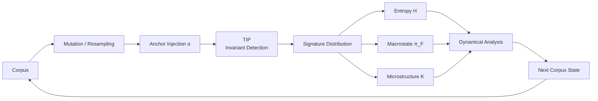
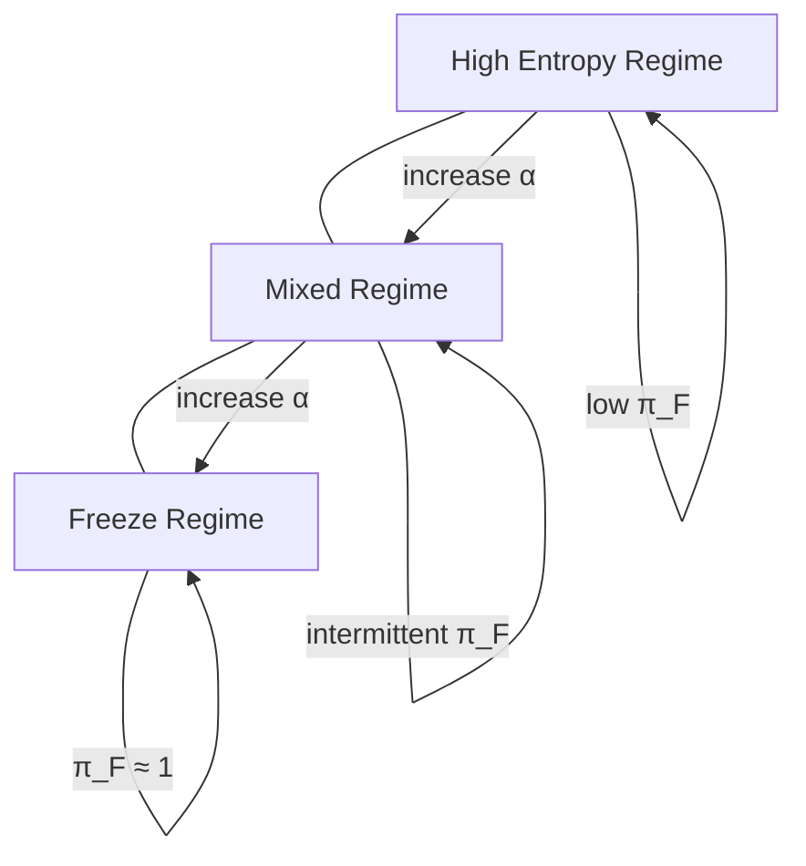
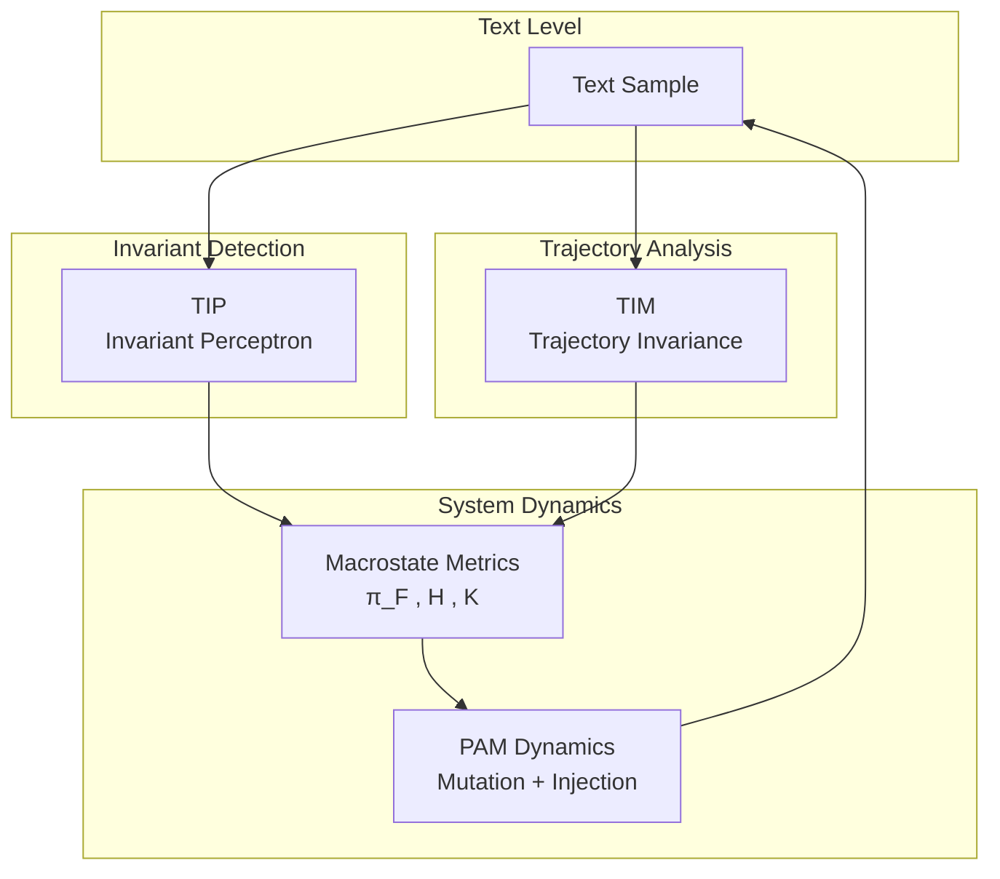

# PAM – Phase Analysis of Meaning

Experimental framework for studying **phase transitions in invariant-driven text dynamics**.

PAM evolves a corpus under controlled mutation and resampling dynamics and measures emergent macrostates such as **freeze**, **entropy**, and **microstructure complexity**.

The goal is to explore how stable semantic structure emerges in recursive text systems.

---

# Repository Structure

src/pam/
Core framework implementation

experiments/
Runnable experiment scripts (quench, sweeps, batch)

outputs/
Generated experiment data

---

# Core Components

### TIP — Invariant Perceptron
Detects semantic invariant signatures in text.

### TIM — Trajectory Invariance Metric
Measures structural stability of text trajectories under perturbation.

### Dynamics
Corpus evolution through mutation, resampling, and anchor injection.

### Metrics

- entropy
- macrostate classification
- lag correlation
- minimal dynamical regressions

---

# Quick Start

Run a batch experiment:

PYTHONPATH=src python3 experiments/exp_batch.py

Outputs are written to:

outputs/index.csv
outputs/deep_*.json

---

# Visualization

Render phase surfaces:

PYTHONPATH=src python3 experiments/plot_phase_surfaces.py

---

# Requirements

Python **3.10+**

Install dependencies:

pip install numpy pandas matplotlib

---

## Minimal Example

Run a single quench experiment and print the core observables.

```python
from pam.tip import InvariantSpec, InvariantPerceptron
from pam.corpora import texts_C
from pam.types import RunParams
from pam.dynamics import run_quench
from pam.injectors import (
    top_k_signatures,
    mutation_injector_multi_sig_factory,
    mixture_injector_factory,
    self_resample_generator,
)

from pam.metrics.entropy import compute_entropy_series
from pam.metrics.macrostate import sliding_piF

# Build invariant detector
invariants = [
    InvariantSpec("reflective", 0.6),
    InvariantSpec("coherent", 0.6),
    InvariantSpec("playful_serious", 0.6),
    InvariantSpec("geometric", 0.6),
]

tip = InvariantPerceptron(invariants=invariants, mode="heuristic")

# Simulation parameters
params = RunParams(alpha=0.075, r=0.30, seed=0, iters=300, anchor_set_size=10)

# Injector protocol
targets = top_k_signatures(tip, texts_C, k=2)
anchor_inj = mutation_injector_multi_sig_factory(tip, targets)
mix_inj = mixture_injector_factory(anchor_inj, self_resample_generator)

# Run system
result = run_quench(
    texts0=texts_C,
    tip=tip,
    mixture_injector=mix_inj,
    params=params,
    alpha_schedule=lambda it: 0.075,
)

# Observables
entropy = compute_entropy_series(result.corp_snapshots, tip, anchor_set_size=10)
freeze = sliding_piF(result.states, W=30)

print("final entropy:", entropy[-1])
print("freeze occupancy:", freeze[-1])

```
Example output:

final entropy: 0.74
freeze occupancy: 0.61

## System Overview

PAM evolves a text corpus under controlled mutation and anchor injection.  
Invariant signatures are detected using TIP, and system dynamics are measured using entropy, macrostate occupancy, and minimal dynamical models.


## Phase Geometry

The system explores a phase space defined by the parameters:

- replacement fraction **r**
- anchor injection probability **α**


---

## Architecture

PAM is built around three interacting components:

- **TIP** — detects invariant semantic signatures in text
- **TIM** — measures trajectory stability under perturbations
- **PAM dynamics** — evolves the corpus and measures emergent macrostates


---

## Key Hypothesis

Recursive text systems exhibit **phase structure** when invariant-preserving mutations interact with anchor injection.

We hypothesize three dynamical regimes:

| Regime | Characteristics |
|------|----------------|
| **Entropy-dominated** | high diversity of invariant signatures |
| **Mixed phase** | intermittent stability and drift |
| **Freeze regime** | stable invariant signatures dominate |

The transition between these regimes is controlled by the parameters:

- **r** — replacement fraction
- **α** — anchor injection probability

Observable signals of these phase transitions include:

- **π_F** — freeze macrostate occupancy
- **H** — signature entropy
- **K** — microstructure complexity
- **ΔR²** — causal coupling between entropy and freeze dynamics

PAM provides a controlled experimental environment for probing the stability of semantic structure in recursively generated text systems.

---

## Research Summary

We study a controlled recursive text system designed to probe stability and collapse dynamics in self-generated language corpora.

PAM investigates the dynamics of recursively updated language-model corpora under controlled mutation and anchoring.

The system is modeled as a discrete-time dynamical process over a semantic state space and analyzed using three orthogonal observables:

- **Freeze Occupancy (π_F)** — structural convergence of the corpus
- **Signature Entropy (H)** — diversity of invariant signatures
- **Trajectory Invariance Metric (TIM)** — robustness of semantic trajectories under perturbation

Parameter sweeps across anchor strength **α**, mutation ratio **r**, and smoothing scale **W** reveal regime-dependent behavior including entropy-dominated drift, metastable coexistence, and freeze-dominated structural persistence.

Lag-correlation analysis shows strong anticorrelation between freeze occupancy and entropy, while nested regression tests indicate minimal direct cross-predictive power. This suggests that both observables reflect a shared latent regime variable rather than causal forcing.

The framework provides a general protocol for discovering phase structure in recursive generative systems.

---

# Research Goal

Map the **phase geometry** of the system in parameter space:

(r, α)

Where:

- **r** — replacement fraction
- **α** — anchor injection probability

Primary observables:

- freeze occupancy **π_F**
- entropy **H**
- microstructure complexity **K**
- causal coupling **ΔR²**

The objective is to identify regimes where recursive text systems transition between **entropy-dominated**, **mixed**, and **freeze-dominated** phases.

---

## Interpretation Guide

The PAM observables describe the macroscopic behavior of the evolving corpus.

| Observable | Meaning |
|---|---|
| **π_F** | freeze macrostate occupancy |
| **H** | entropy of invariant signatures |
| **K** | microstructure complexity |
| **ΔR²** | causal coupling between freeze and entropy dynamics |

Typical regime patterns:

| Regime | π_F | H | Interpretation |
|---|---|---|---|
| **Entropy-dominated** | low | high | signatures drift freely |
| **Mixed phase** | medium | medium | intermittent stabilization |
| **Freeze regime** | high | low | stable invariant signatures dominate |

Causal coupling ΔR² helps determine directional influence:

- **ΔR²_freeze > ΔR²_entropy**  
  → entropy fluctuations tend to **drive freeze formation**

- **ΔR²_entropy > ΔR²_freeze**  
  → freeze states tend to **constrain entropy**

These signals help characterize the **phase geometry** of the system across parameter space.

---

## Status

PAM is an experimental research framework under active development.

Current work focuses on:

- mapping the phase geometry across (r, α)
- testing the stability of invariant signatures under recursive mutation
- characterizing freeze–entropy causal coupling

---

# License

This project is licensed under the MIT License — see the `LICENSE` file for details.


