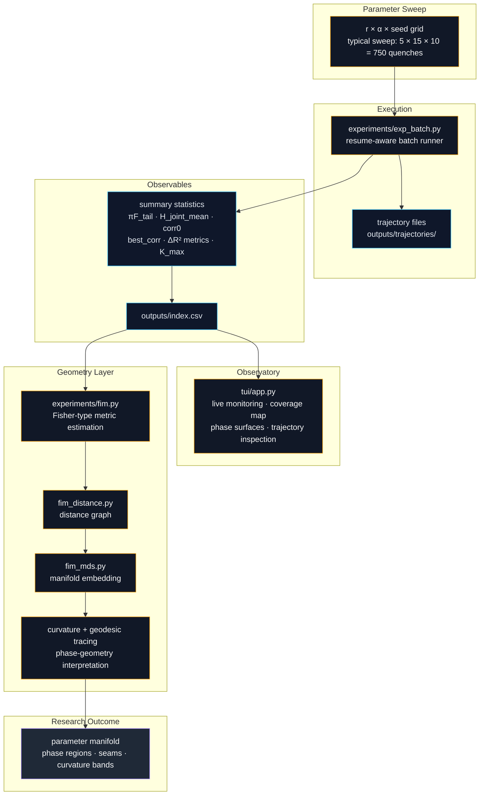

# PAM Observatory

> Experimental framework for exploring phase structure in recursive language systems.

PAM Observatory is a research instrument for studying recursive text dynamics under controlled parameter sweeps.
It runs batches of quenches over a parameter grid, extracts dynamical observables, exposes a live terminal observatory for monitoring and inspection, and builds a downstream geometry layer for Fisher-type metrics, manifold embedding, curvature, and geodesic analysis.

---

## Research Pipeline



In one line:

```text
quench experiments → observables → observatory → geometry → phase interpretation
```

---

## What this repository does

The repository currently supports a layered workflow:

```text
quench experiments
        ↓
trajectory statistics
        ↓
observable phase surfaces
        ↓
Fisher-type metric tensor
        ↓
Fisher geodesic distances
        ↓
manifold embedding (MDS)
        ↓
phase geometry interpretation
```

This gives the project four practical pillars:

- experiments
- observatory
- geometry
- documentation

---

## Observatory Interface

The PAM Observatory TUI is designed as a live research instrument rather than a post hoc plotting layer.
It exposes three conceptual levels:

1. **Coverage**  
   Which parameter combinations have already been computed.

2. **Phase Diagram**  
   Aggregated observables across parameter space.

3. **Detail View**  
   Local dynamics for a specific parameter configuration.

The interface supports row, cell, and trajectory inspection modes, plus screenshot export for documentation and movie generation.

---

## Parameter Sweep

Experiments explore the parameter manifold

```math
\theta = (r, \alpha)
```

with a typical grid:

```text
r ∈ {0.10, 0.15, 0.20, 0.25, 0.30}
α ∈ linspace(0.03, 0.15, 15)
seeds = 10
```

Total experiments:

```text
5 × 15 × 10 = 750 quenches
```

Each run appends a summary row to:

```text
outputs/index.csv
```

and may also write trajectory files to:

```text
outputs/trajectories/
```

---

## Core Observables

Typical summary observables include:

- `piF_tail`
- `H_joint_mean`
- `corr0`
- `best_corr`
- `delta_r2_freeze`
- `delta_r2_entropy`
- `K_max`

These fields form the bridge between raw dynamics and phase-level geometry.

A useful next documentation layer for this repository is a short observable glossary explaining, for each field:

- what it measures
- why it matters
- how to read high / low values
- where it appears in the observatory

---

## Running the Experiment Sweep

```bash
python experiments/exp_batch.py
```

The batch runner is resume-aware and continues from existing rows in `outputs/index.csv`.

---

## Launching the Observatory

```bash
PYTHONPATH=. python tui/app.py
```

The TUI reads live experiment outputs and updates automatically while the sweep progresses.

---

## Controls

```text
↑ ↓     change r
← →     change α
Enter   toggle row / cell inspection
T       trajectory view
S       save SVG screenshot
```

Screenshots are saved to:

```text
tui/screenshots/
```

---

## Observatory Artifacts

The repository includes a movie tool for turning saved observatory screenshots into GIF or MP4 artifacts.

```bash
python tools/phase_movie.py \
  --input-dir tui/screenshots \
  --output tui/screenshots/phase_movie.gif \
  --fps 4 \
  --hold 3
```

### macOS note

For SVG screenshot conversion on macOS, you may need:

```bash
brew install cairo
brew install ffmpeg
export DYLD_FALLBACK_LIBRARY_PATH=/opt/homebrew/lib
```

Python dependencies:

```bash
pip install cairosvg pillow
```

---

## Fisher Geometry Layer

A first-pass Fisher-type metric estimator lives at:

```text
experiments/fim.py
```

It operates on the observable summaries in `outputs/index.csv` and estimates a metric of the form:

```math
g_{ij} = \partial_i m^\top \Sigma^{-1} \partial_j m
```

where `m(r, α)` is the observable vector and `Σ` is an empirical noise covariance estimated from seed variability.

Current downstream geometry work includes:

- local Fisher surfaces
- determinant and anisotropy diagnostics
- Fisher-distance graphs
- MDS embeddings of the parameter manifold
- scalar curvature estimation
- candidate phase-boundary detection
- Fisher geodesic tracing

---

## Repository Structure

```text
pam-research/
│
├─ docs/
├─ experiments/
│  ├─ exp_batch.py
│  ├─ common_quench_metrics.py
│  ├─ fim.py
│  └─ ...
│
├─ outputs/
│  ├─ index.csv
│  ├─ trajectories/
│  ├─ fim/
│  └─ ...
│
├─ scripts/
├─ src/
│  └─ pam/
├─ tools/
├─ tui/
│  ├─ app.py
│  ├─ screenshots/
│  └─ ...
│
├─ README.md
├─ requirements.txt
└─ run_batch.sh
```

---

## Suggested reading path

If you are new to the project, a good order is:

1. Read this README for the pipeline overview.
2. Run a small sweep and inspect `outputs/index.csv`.
3. Launch the observatory and watch the live instrument.
4. Read the geometry scripts after the observables make intuitive sense.

---

## Status

The observatory now spans:

- batch experiment execution
- live terminal monitoring
- summary observable collection
- Fisher-type geometry estimation
- manifold embedding and phase interpretation

The long-term aim is to make phase structure in recursive language systems directly observable while experiments are still running.
