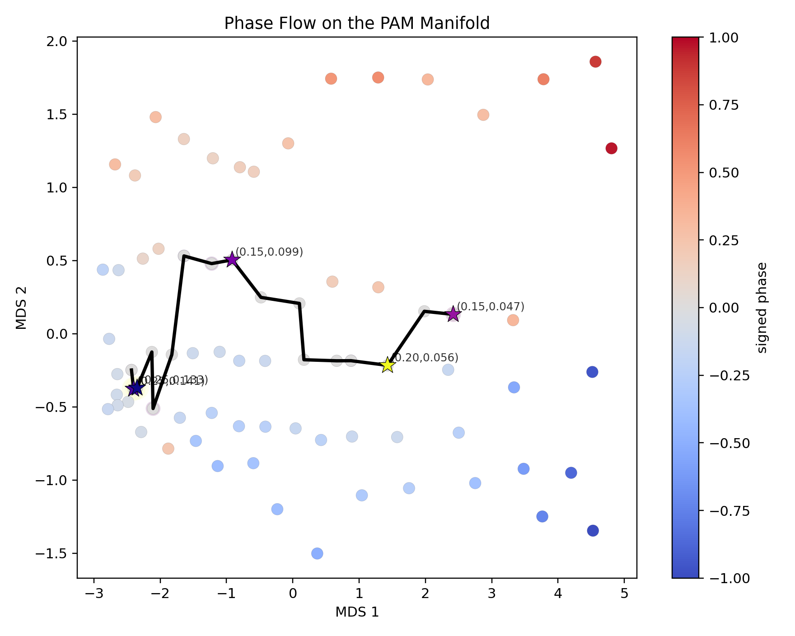

# PAM Observatory

**Phase Analysis of Meaning (PAM)**

[](https://www.python.org/)
[](#current-research-state)
[](#foundational-manifold-and-phase-structure)
[](https://doi.org/10.5281/zenodo.19218700)

The **PAM Observatory** is a file-first computational instrument for studying how recursive language systems organize, transition, and retain or lose structure under controlled transformations.

It combines recursive corpus dynamics, information geometry, multiscale field analysis, phase and transition extraction, operator-guided probing, reusable-invariance testing, and provenance-controlled discovery–confirmation studies.

The repository has progressed from foundational phase-manifold reconstruction to a broader evidential program:

- identify compact structural and dynamical relations;
- test whether those relations survive alternate contracts and resampling schemes;
- register their reusable carriers and scope conditions;
- localize failure support without overstating causality or actionability;
- evaluate direct witnesses under blinded discovery and reserved confirmation;
- determine whether frozen evidence gates are statistically attainable under available independent-object support.

> The goal is not only to identify what a system *is*, but to determine how its measured organization behaves under declared transformations.

---

## Foundational Preprint

**Geometric Constraints on Transition Dynamics in Recursive Language Systems**

- [Zenodo record](https://zenodo.org/records/19218700)
- [DOI: 10.5281/zenodo.19218700](https://doi.org/10.5281/zenodo.19218700)

The preprint documents the foundational geometric program. The live repository has since expanded through later observatory studies, artifact registries, blinded evidence protocols, and prospective design-metrology work.

---

## Current Research State

The foundational manifold, phase, operator, transport, and transition-geometry layers are implemented. The current frontier is **evidence qualification**: deciding which observed relations are reusable, directly supported, independently confirmable, and statistically attainable under a frozen dependence structure.

### Current evidential position

| Layer | Current state |
|---|---|
| Foundational geometry and phase instrument | Implemented |
| Multiscale transition and stability analysis | Established within tested contracts |
| Reusable Invariance Registry | Operational |
| Registry intervention readiness | Not established |
| Confirmed FL3 direct failure witnesses | **0** |
| OBS-085 structural evidence feasibility | Completed |
| OBS-085 simulator qualification | Completed with narrow scope |
| OBS-085b complete gate passages | **0** under the frozen contract |
| OBS-085c prospective campaign attainability | Current committed study; canonical full-run result not yet claimed here |

The present evidence spine is:

```text
OBS-076–077  multiscale structural and transition geometry
      ↓
OBS-078–080  compact stability signature and contract robustness
      ↓
OBS-081      Reusable Invariance Registry
      ↓
OBS-082–083  readiness, contrast, and localization audits
      ↓
OBS-084      blinded discovery and reserved confirmation
      ↓
OBS-085      structural feasibility, simulator qualification,
             conditional gate passage, and prospective attainability
```

See [`docs/research_log.md`](docs/research_log.md) for the numbered observatory record.

---

## Evidence Ladder

PAM distinguishes increasingly demanding evidential levels rather than treating every stable pattern as actionable.

1. **Structural organization**  
   Geometry, phases, seams, routes, fields, transitions, and multiscale supports.

2. **Reusable invariance**  
   Relations that survive declared transformations, feature contracts, and resampling schemes.

3. **Diagnostic localization**  
   Evidence about where and why a registered relation weakens or fails.

4. **Direct witnessing**  
   Artifact-indexed supports evaluated under frozen discovery and independent confirmation.

5. **Actionability**  
   Localized, controlled, independently supported intervention hypotheses.

The repository contains mature results at Levels 1–3. OBS-084 tested Level 4 but established no FL3 witness. Level 5 has not been reached.

---

## Scientific Program

### 1. Foundational manifold and phase structure

The original instrument studies the control manifold

```math
\theta = (r, \alpha)
```

through controlled recursive experiments and a layered geometry stack:

- Fisher information metric;
- graph and geodesic distances;
- manifold embedding;
- curvature estimation;
- seam extraction;
- signed phase coordinates;
- operator and response-field probes;
- transport, obstruction, and route-family diagnostics.



Each point represents a parameter configuration embedded using Fisher-geodesic distances. Color encodes a signed phase coordinate, revealing two regimes separated by an emergent transition region. This figure remains foundational, but later studies test whether the resulting relations persist beyond a single geometric view.

### 2. Multiscale stability structure

OBS-076–080 extended the observatory from a fixed manifold slice into observable scale-space and transition geometry.

Within the tested C/Cp2/Cp3 artifact lineage, the principal distinction compressed to a compact local stability signature built around:

- local divergence;
- local displacement;
- boundedness.

The tested interpretation is:

- **C** — bounded stability;
- **Cp2** — high-divergence, low-boundedness recovery sorting;
- **Cp3** — high-displacement, low-boundedness instability and settlement.

This compact signature survived the declared transform, scale-band, feature-family, held-structure, bootstrap, and structural-resampling contracts. It remains model-specific, corpus-specific, artifact-specific, and contract-specific.

### 3. Reusable Invariance Registry

OBS-081 converted stability-contract results into an operational **Reusable Invariance Registry (RIG)**.

Registry records bind together:

- relation identity;
- carrier identity and role;
- invariant status;
- geometry-needed level;
- failure localization;
- repair pressure and recommendation;
- provenance and artifact lineage.

OBS-082 scored all 24 registry records for intervention readiness. All remained **diagnostic-only**: no record reached candidate-ready or hypothesis-ready status.

OBS-083 then refined the flat diagnostic class into:

- **C1 contrast-limited** — 12 records;
- **C2 localization-limited** — 12 records.

No direct artifact locus or intervention-ready repair candidate was established.

Registry artifacts live under [`outputs/rig_registry/`](outputs/rig_registry/).

### 4. Blinded direct failure-support evaluation

OBS-084 implemented the first fully frozen artifact-direct discovery–confirmation protocol in the repository.

Before discovery, the study froze:

- scientific observation identity;
- carrier and field-role definitions;
- discovery and confirmation partitions;
- support vocabulary;
- seam discretization;
- source identities and manifests;
- promotion and entitlement rules.

Discovery evaluated 5,736 predicate-indexed tests and sealed thirteen non-dominated FL2 candidate supports. The reserved confirmation partition was opened once and evaluated only those sealed candidates.

**Result: FL3 direct witnesses established — 0.**

The primary contribution was methodological: the instrument enforced discovery–confirmation separation and refused unsupported promotion.

### 5. Detection-envelope and attainability studies

OBS-085 asks whether evidence is not only structurally definable, but also estimable and statistically attainable under the declared object-cluster dependence structure.

#### OBS-085a — Structural evidence feasibility

OBS-085a performed a deterministic structural audit over the frozen OBS-084 address universe. It distinguished **EvidenceFeasible** from **ClaimEntitled** and did not inject effects or estimate power.

#### OBS-085b0 — Simulator qualification

OBS-085b0 qualified injection and simulator machinery rather than scientific claims. Only the `measurement_missingness_concentration` predicate was authorized, under two simulator families and explicit scope limits:

- joint Gaussian regularized cluster;
- joint wild-cluster Rademacher.

#### OBS-085b — Conditional gate-passage sensitivity

OBS-085b evaluated the frozen ten-gate evidence contract across 600,000 conditional simulation replicates.

No replicate passed the complete contract. Follow-up attainability auditing localized the decisive limitation: the effective independent-cluster count never exceeded three, so the minimum attainable exact one-sided sign-flip p-value was 0.125, above the frozen threshold of 0.10.

This is a gate-attainability result, not evidence that the injected missingness response was absent.

#### OBS-085c — Prospective campaign attainability

[`experiments/studies/obs085c_campaign_attainability_simulation.py`](experiments/studies/obs085c_campaign_attainability_simulation.py) prospectively varies independent object-cluster support while preserving the frozen OBS-085b evidence contract.

It distinguishes:

- **structurally attainable** — the exact-test resolution can reach the frozen alpha;
- **empirically passable** — at least one simulated replicate passes all frozen gates;
- **reliably passable** — conditional passage reaches a declared reporting target.

OBS-085c is a design-metrology study. It does not repair, reinterpret, or reopen OBS-085b, and it does not increase claim entitlement.

---

## Claim Boundaries

Unless a study explicitly establishes otherwise, repository results are:

- model-specific;
- corpus-specific;
- subset-specific where declared;
- artifact- and contract-specific;
- conditional on declared preprocessing, support definitions, and dependence units;
- observational, diagnostic, or simulation-conditional rather than causal;
- not evidence of universal semantic topology;
- not evidence of intervention readiness or control.

Simulation studies quantify behavior under declared simulator assumptions. They do not establish that a simulated mechanism caused an observed result.

The repository uses terms such as *topology*, *groupoid*, *field*, *phase*, *horizon*, and *invariance* operationally within the observatory. Unless explicitly demonstrated, these should not be read as completed formal-mathematical or model-independent claims.

---

## Instrument Architecture

PAM now has three distinct reproducibility surfaces.

### 1. Canonical runtime instrument

The packaged runtime architecture lives under [`src/pam/`](src/pam/) and is orchestrated through:

```bash
bash scripts/run_full_pipeline.sh
```

Canonical stages:

```text
engine
  ↓
measurement
  ↓
observables
  ↓
geometry
  - Fisher metric
  - distance graph
  - embedding
  - curvature
  ↓
phase
  - seam extraction
  - seam distance
  - signed phase
  ↓
operators
  - geodesic extraction
  - probes and scaled probes
  - Lazarus and transition diagnostics
  ↓
topology / relational organization
  - field alignment
  - transport obstruction
  - critical structure
  - organizational summaries
```

The canonical orchestration lives in:

- [`src/pam/pipeline/stages/`](src/pam/pipeline/stages/)
- [`src/pam/pipeline/runner.py`](src/pam/pipeline/runner.py)
- [`scripts/run_full_pipeline.sh`](scripts/run_full_pipeline.sh)

### 2. Numbered observatory studies

Active analytical studies live under [`experiments/studies/`](experiments/studies/).

Mature studies declare their:

- input artifacts;
- output root;
- scientific scope;
- frozen contracts;
- validation and self-test modes;
- manifest and provenance requirements.

These studies are not automatically equivalent to stages in the packaged runtime pipeline.

### 3. Frozen evidence campaigns

Later RIG and detection-envelope studies live under [`outputs/rig_registry/`](outputs/rig_registry/).

These campaigns may validate:

- upstream manifest identity;
- artifact hashes;
- script hashes;
- source and support identities;
- candidate sealing;
- discovery/confirmation partitions;
- repository commit ancestry.

This layer treats repository-facing artifacts and documentation as part of the scientific instrument.

---

## Additional Observatory Layers

### Canonical family and gateway layer

The downstream canonical family layer lives in:

- [`scripts/canonical/`](scripts/canonical/)
- [`outputs/canonical/`](outputs/canonical/)
- [`docs/05_project/`](docs/05_project/)

It provides family-level gateway summaries, temporal-depth and memory-compression summaries, event normalization and assignment, and integrated cross-table validation. Parts remain provisional in provenance depth, assignment maturity, and trajectory linkage, so the layer has not been fully promoted into `src/pam/`.

See:

- [`docs/05_project/README.md`](docs/05_project/README.md)
- [`docs/05_project/canonical_family_layer_status.md`](docs/05_project/canonical_family_layer_status.md)

### Response-guided dynamics

The repository includes a first-pass response-guided dynamical layer:

- [`experiments/studies/obs043_response_flow.py`](experiments/studies/obs043_response_flow.py)
- [`experiments/studies/obs043b_response_flow_path_families.py`](experiments/studies/obs043b_response_flow_path_families.py)
- [`docs/05_project/canonical_response_guided_flow.md`](docs/05_project/canonical_response_guided_flow.md)

This layer supports seam-engaged embedded flow paths, flow-regime comparison, seam-bundle modulation tests, and first-pass route-family decomposition. It remains methodologically discretized and is not a canonical runtime primitive.

### Linked-response taxonomy

The linked-response observatory layer is annotation-backed and repository-facing:

- [`docs/05_project/linked_response_family_taxonomy.md`](docs/05_project/linked_response_family_taxonomy.md)
- [`docs/05_project/linked_response_annotation_protocol.md`](docs/05_project/linked_response_annotation_protocol.md)
- [`docs/05_project/linked_response_artifacts.md`](docs/05_project/linked_response_artifacts.md)

The current linked-response result is within-model, GPT-5.2-specific, and provisional. It is not a runtime primitive.

---

## Repository Structure

```text
src/pam/
  engine/          runtime dynamics and injector logic
  measurement/     TIP, TIM, and measurement builders
  observables/     core and derived observables
  geometry/        FIM, distances, embedding, curvature, geodesics
  phase/           seam extraction, seam distance, signed phase
  operators/       probes, Lazarus, transition-rate analysis
  topology/        alignment, obstruction, criticality, organization
  pipeline/        PipelineState, stages, runner

observatory/
  corpora/         externalized corpus payloads and registry
  runs/
  derived/
  reports/
  figures/

experiments/
  studies/         active numbered analytical studies
  toy/             pedagogical and toy experiments
  archive/         legacy and superseded material

scripts/
  canonical runtime entrypoints, guards, and downstream canonicalization

outputs/
  file-first artifact store
  rig_registry/    reusable-invariance and evidence-campaign artifacts

docs/
  research_log.md  numbered observatory record
  05_project/      repository-facing project and instrument documentation
```

---

## Reproducibility

### Canonical runtime

```bash
bash scripts/run_full_pipeline.sh
```

### Study validation pattern

Many mature study scripts support some combination of:

```bash
PYTHONPATH=src .venv/bin/python experiments/studies/<study>.py --self-test
PYTHONPATH=src .venv/bin/python experiments/studies/<study>.py --validate-only
PYTHONPATH=src .venv/bin/python experiments/studies/<study>.py --smoke --overwrite
```

Consult each script’s module documentation before executing a canonical run. Do not infer that a smoke run, reduced replicate count, or regenerated artifact bundle is canonical merely because it completed successfully.

### File-first provenance

- Derived outputs are written under `outputs/`.
- Corpus payloads are externalized under `observatory/corpora/`.
- Mature evidence studies emit manifests, hashes, reports, and failure tables.
- Completed blinded or qualification studies should not be retroactively altered after results are observed.

---

## Documentation Anchors

- [`docs/README.md`](docs/README.md)
- [`docs/research_log.md`](docs/research_log.md)
- [`docs/05_project/README.md`](docs/05_project/README.md)
- [`observatory/corpora/README.md`](observatory/corpora/README.md)
- [`src/pam/pipeline/runner.py`](src/pam/pipeline/runner.py)
- [`scripts/run_full_pipeline.sh`](scripts/run_full_pipeline.sh)
- [`outputs/rig_registry/`](outputs/rig_registry/)

---

## One-Line Summary

> The PAM Observatory is a provenance-controlled computational instrument for moving from geometric phase discovery to reusable-invariance testing, blinded evidence evaluation, and prospective detection-attainability analysis in recursive language systems.

---

## License

[MIT License](LICENSE)
