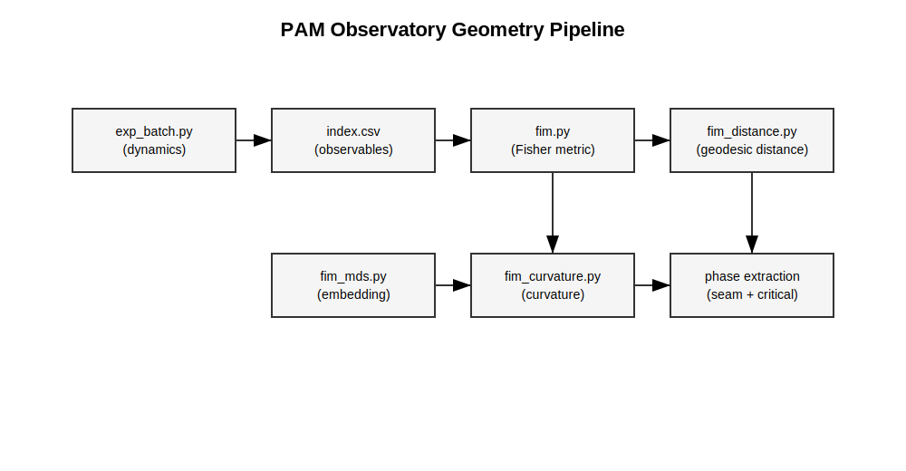

# Geometry Analysis Pipeline

This document defines how experimental observables are transformed into an intrinsic manifold geometry in the PAM Observatory.

---

## Pipeline Overview

---

## Parameter Manifold

The PAM Observatory studies a parameter manifold:

```math
\theta = (r, \alpha)
```

where:
- r controls recursion / coupling strength
- α controls update / mixing dynamics

---

## Fisher Information Metric

The Fisher Information Metric defines local geometry:

```math
G_{ij}(\theta) = \partial_i m(\theta)^T \Sigma^{-1} \partial_j m(\theta)
```

Where:
- m(θ) = observable vector
- Σ = covariance of observables

Interpretation:
- Measures sensitivity of observables to parameter changes
- High values indicate sharp behavioral transitions

---

## Geodesic Distance

Distances on the manifold are defined as:

```math
d_G(\theta_1, \theta_2) = \inf_{\gamma} \int \sqrt{\dot{\gamma}^T G(\gamma) \dot{\gamma}} \, dt
```

In practice:
- Approximated via graph shortest paths
- Nodes = parameter grid points
- Edges = local Fisher distances

---

## MDS Embedding

The manifold is embedded into 2D using multidimensional scaling (MDS):

- Preserves geodesic distances
- Produces visual coordinates (mds1, mds2)

Interpretation:
- Reveals global structure
- Makes curvature and seams visible

---

## Curvature

Curvature is derived from the metric:

- Scalar curvature approximated numerically
- Highlights regions of instability and transition

Interpretation:
- High curvature → high sensitivity
- Indicates phase transition regions

---

## Phase Structure

A signed phase field is constructed over the manifold:

- Separates distinct behavioral regimes
- Defines a phase boundary (seam)

Interpretation:
- Seam = outcome-equivalence boundary
- Crossing seam = qualitative change in system behavior

---

## Christoffel Symbols (Connection)

Local geometric dynamics are defined by:

```math
\Gamma^k_{ij} = \frac{1}{2} G^{kl}
\left(
\partial_i G_{jl} +
\partial_j G_{il} -
\partial_l G_{ij}
\right)
```

Interpretation:
- Defines how trajectories bend under the geometry
- Enables continuous geodesic dynamics

---

## Implementation Mapping

| Concept | File |
|--------|------|
| Experiments | experiments/exp_batch.py |
| Observables | outputs/index.csv |
| Fisher metric | experiments/fim.py |
| Distance graph | experiments/fim_distance.py |
| MDS embedding | experiments/fim_mds.py |
| Curvature | experiments/fim_curvature.py |
| Phase extraction | experiments/fim_signed_phase.py |

---

## Outputs

- outputs/fim/
- outputs/fim_distance/
- outputs/fim_mds/
- outputs/fim_curvature/
- outputs/fim_phase/

---

## Summary

The pipeline converts experimental observables into an intrinsic geometric structure:

- Metric → defines local sensitivity
- Distances → define global structure
- Embedding → makes structure visible
- Curvature → reveals transitions
- Phase → defines qualitative regimes

This forms the geometric backbone of the PAM Observatory.
