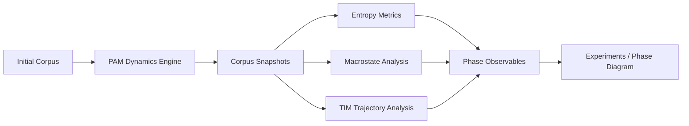

# PAM Architecture

This document explains the conceptual architecture of the PAM research framework.

PAM is designed to study **recursive language dynamics** as a dynamical system. The framework evolves a corpus under controlled mutation and anchoring dynamics and measures macroscopic observables such as entropy and freeze occupancy.

The system consists of four major layers:

1. Invariant detection (TIP)
2. Corpus dynamics (PAM engine)
3. Macroscopic metrics
4. Experiment runners

---

# Conceptual Pipeline

